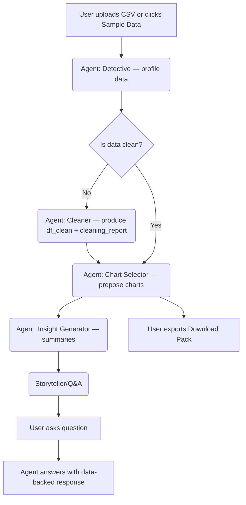

# User Flow — AnalystAI

Flow notes

- Each agent step writes to `st.session_state` so the UI reflects progress.
- User can remove file or load sample data at any time; removing clears cached state.
- Download pack aggregates the report, cleaned CSV, and chart specs into a zip.
